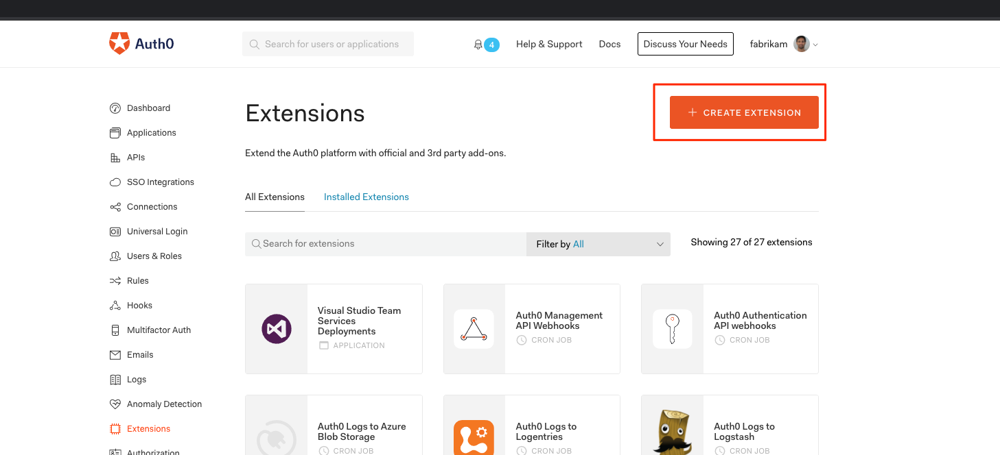
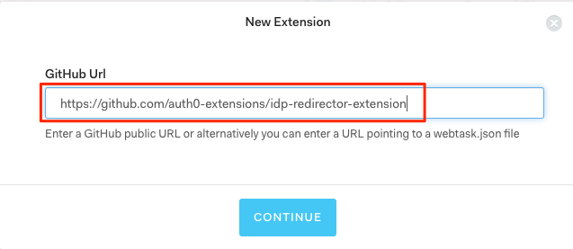

# IdP Redirector Extension

## Run locally

```bash
npm install
```

Update `./server/config.json` with config values.

```bash
npm run serve:dev
```

## Publish

```bash
npm run extension:build
git add .
git commit -m 'build x'
git push origin master
```

## Deploying to Auth0

Navigate to the Extensions section of the Auth0 Management Dashboard

Click “Create Extension” as shown in the below screenshot



Enter the URL of the github repo where the IdP Redirector Extension is located and click Continue to install.



## Publishing Update

Create a new release in [github](https://github.com/auth0-extensions/idp-redirector-extension/releases/) and set a `tag version` to new semantic version `major.minor.patch` of the extension.

This will enable "Update" option in all tenants where the extension is installed.


